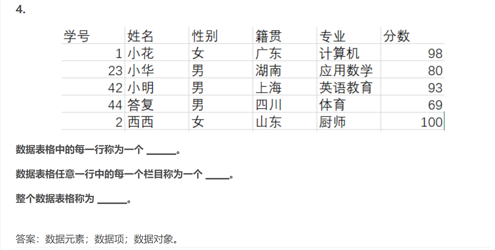

## 基本概念和术语

```
数据、数据元素、数据项、数据对象、数据类型、数据结构
数据结构是相互之间存在一种或多种特定关系的数据元素的集合。
```



## 数据结构的三要素

```
逻辑结构
	与数据的存储无关，是独立于计算机的。
存储结构
	也成为物理结构，存储两个东西，一个是数据元素，一个是数据元素之间的关系
数据的运算
```

## 算法和算法评价

```
（我的理解）数据结构三要素中的数据的运算仅仅是类似数学中的运算法则的东西，告诉你能够做哪些操作；而算法是进行某一系列操作来达到某种目的。比如冒泡排序，执行一系列的交换、比较操作，以达到升序或者降序排列的目的。其中的冒泡排序就是算法，而交换、比较操作则是数据结构三要素中的数据的运算。感觉上数据的运算更加机械，偏向于底层实现，而算法更偏向于逻辑和用户需求。
```

算法效率的度量

```
时间复杂度
	一个语句的频度是指该语句在算法中被重复执行的次数
	T(n)是算法中所有语句的频度之和，它是该算法问题规模n的函数
	时间复杂度主要分析T(n)的数量级
	算法中的基本运算(最深层循环内的语句)的频度与T(n)同数量级，因此通常采用算法中基本运算的频度f(n)来分析算法的时间复杂度。因此算法的时间复杂度记为T(n)=O(f(n))。

空间复杂度
	算法的空间复杂度S(n)定义为该算法所耗费的存储空间，它是问题规模n的函数。
	存储的内容大致为本身所用的指令、常数、变量、输入数据和辅助空间
	算法原地工作是指算法所需的辅助空间为常量即O(1)
```

