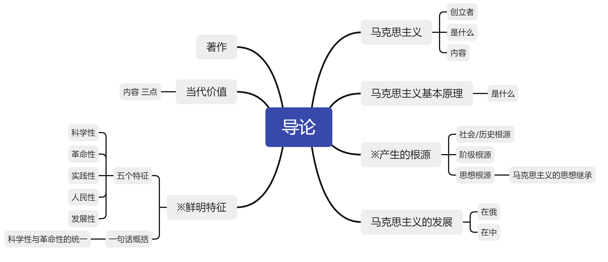

## 马克思主义基本原理大纲

内容可分为1+3个部分：导论 + 马克思主义哲学、政治经济学、科学社会主义

## 导论

导论
	马克思主义
		创立者
		是什么
		内容
	马克思主义基本原理
		是什么
	※产生的根源
		社会/历史根源
		阶级根源
		思想根源
			马克思主义的思想继承
	马克思主义的发展
		在俄
		在中
	※鲜明特征
		五个特征
			科学性
			革命性
			实践性
			人民性
			发展性
		一句话概括
			科学性与革命性的统一
	当代价值
		内容 三点
	著作

### 马克思主义

是由马克思恩格斯创立并由后继者不断发展的科学理论体系。马克思主义包括：马克思主义哲学、马克思主义政治经济学、科学社会主义

### 马克思主义的基本原理

是对马克思主义立场、观点和方法的集中概括。

为什么会有这个知识点？我的理解是：学习的内容是马克思主义基本原理而不是马克思主义，理应能分清基本原理和本身之间区别与联系。

### 马克思主义产生的根源

社会/历史根源：资本主义的发展为马克思主义的产生提供了经济、社会历史条件。

阶级根源：无产阶级在反抗资产阶级剥削和压迫的斗争中，逐步走向自觉，并迫切渴望科学的理论指导。

思想根源：马克思恩格斯的革命实践和对人类文明成果的继承与创新。

马克思恩格斯的思想继承：

​        马克思主义哲学源自德国古典哲学

​        马克思主义政治经济学源自英国古典政治经济学

​        科学社会主义源自法国、英国的空想社会主义

### 马克思主义的发展

在俄：列宁

在中：毛泽东思想、邓小平理论、三个代表重要思想、科学发展观、习近平新时代中国特色社会主义思想

### 马克思主义的鲜明特征

科学性：马克思主义是对自然、社会和人类思维发展本质和规律的<u>正确反映</u>。

革命性：马克思主义集中表现了<u>彻底的批判精神和鲜明的无产阶级的立场</u>。

实践性：马克思主义是<u>从实践中来，到实践中去</u>，在实践中接受检验，并随实践而不断发展的学说。

​    实践性是马克思主义理论区别于其他理论的显著特征

人民性：<u>人民至上</u>是马克思主义的政治立场。

发展性：马克思主义是不断发展的学说，<u>具有与时俱进的理论品质</u>。

### 马克思主义的当代价值

是我们观察当代世界变化的认识工具。

是指引当代中国发展的行动指南。

是引领人类社会进步的科学真理。

### 马克思主义著作

《共产党宣言》是第一部较为完整而系统地阐述科学社会主义基本原理的著作，标志着马克思主义的诞生与公开问世

《德意志意识形态》：标志着唯物史观的创立，标志着马克思主义哲学的成熟

《资本论》：全面阐述了资本主义的发展规律，提出了剩余价值理论，被称为“工人阶级的圣经”

《哲学的贫困》：马克思主义学说最早发布的文本

《法兰西内战》：高度赞扬了巴黎工人的伟大壮举，科学地总结了巴黎公社的历史经验

《家庭、私有制和国家的起源》：恩格斯著写的一部关于古代社会发展规律和国家起源的著作，是马克思主义国家学说代表作之一

《反杜林论》：由恩格斯所著，全面地阐述了马克思主义理论体系，是马克思主义的“百科全书”

《德法年鉴》：由马克思恩格斯共同发表在其上的论文，表明他们完成了从唯心主义到唯物主义，从革命民主主义到共产主义的转变，为创立马克思主义奠定了思想前提。

## 马克思主义哲学

马克思主义哲学由三部分构成：唯物论/辩证法、认识论、唯物史观

### 哲学的基本概念

#### 哲学基本问题及其内容

​    存在和思维谁才是世界的本原；思维能否正确认识存在。存在为本原则是唯物主义，思想是本原则是唯心主义，思维能认识存在是可知论，思维不能认识存在是不可知论。

​    唯物史观和唯心史观。社会存在与社会意识的关系问题是社会历史观的基本问题。唯物史观认为社会存在决定社会意识。唯心史观认为社会意识决定社会存在。

​    辩证法和形而上学。辩证法坚持事物之间普遍存在联系，发展的根本原因在于事物的内部矛盾。形而上学则坚持用孤立、静止的观点看待问题，否认事物内部矛盾的存在。

#### 哲学的历史发展

​    主观唯心主义和客观唯心主义。主观唯心是强调自我的意识；客观唯心是强调独立于“我”的客观存在，例如神，上帝等。

​    古代朴素唯物主义和形而上学唯物主义。古代朴素唯物主义将物质的本质归结为某一种或某一类物质。近代形而上学唯物主义将物质归结为某一种不可再分的细小物质。

​    现代辩证唯物主义。客观实在是物质的本质。

### 唯物论/辩证法

#### 物质观。

​    客观实在性是物质的本质规定。物质的共同特性是客观实在性。

​    恩格斯和列宁对物质的定义。恩格斯“物、物质无非是各种物的总和，而这个概念就是从这一总和中抽象出来的”其通过物质的共性和个性讨论。列宁“物质是标志客观实在的哲学范畴，这种客观实在是人通过感觉感知的，它不依赖于我们的感觉而存在，为我们的感觉所复写、摄影、反映。”列宁是从物质与意识的关系上来把握物质的。

#### 运动观

​    物质和运动。物质和运动是不可分割的。运动是物质的存在形式和根本属性；物质是运动的是在基础和承担者。缺少运动的物质会导致形而上学，缺少物质的运动会导致唯心主义。

​    运动和静止。运动是绝对的，静止是相对的。静止时物质运动在一定条件下的稳定状态，包括空间位置和根本性质两种静止。运动和静止相互依赖、相互渗透、相互包含；静止时运动的衡量尺度。只承认运动不承认静止会导致诡辩论；只承认静止不承认运动会导致形而上学。

#### 时空观

​    时间和空间时物质运动的存在形式。时间空间具有客观实在性，是物质。时间具有一维性，空间具有三维性。

​    物质运动和时空不可分割。没有离开物质运动的纯粹时空，也没有离开时空的物质。具体物质形态的时空是有限的，而整个世界的时空是无限的。物质运动的时空的客观实在性是绝对的，物质运动时空的具体特性是相对的。

#### 意识观

​    意识的起源。意识是自然界长期发展的产物。意识也是社会历史的产物，社会实践特别是劳动在意识的产生和发展中起着决定性的作用；在人们的劳动和交往中形成的语言促进了意识的发展。

​    意识的本质。意识是特殊的物质——人脑的机能和属性。意识在内容上是客观的，在形式上是主观的，是客观内容和主观形式的统一。意识是物质的产物，但不是物质本身。

​    意识的能动作用。即意识对物质的反作用，人特有的积极认识世界改造世界的能力与活动。主要表现在：①意识活动具有目的性和计划性。②意识活动具有创造性。③意识具有指导实践改造客观世界的作用。④意识具有控制人的行为和生理活动的作用。

#### 实践是自然存在与社会存在区分和统一的基础

​    人的实践形成了自然与人类社会的区别。

​    实践是使物质世界分化为自然界与人类社会的历史前提，又是使自然界与人类社会统一起来的现实基础。

​    实践是人类社会的基础，是理解和解释一切社会现象的钥匙。

​    社会生活的实践性主要表现在：①实践是社会关系的基础。②实践形成了社会生活的基本领域。③实践构成了社会发展的动力

#### 主观能动性和客观规律性的统一

​    尊重客观规律性是正确发挥主观能动性的前提；只有充分发挥主观能动性，才能正确认识和利用客观规律。

​    如何正确发挥主观能动性：①从实际出发，努力认识和把握事物的发展规律。②实践是发挥人的主观能动性的基本途径③主观能动性的发挥，还依赖于一定的物质条件和物质手段。

​    人们通过自觉活动能够认识规律和利用规律。（不能改造和创造）

​    实践是客观规律性和主观能动性统一的基础

#### 世界的物质统一原理

​    世界物质统一性原理的内容。①世界是统一的。②世界的统一在于它的物质性。③物质世界的统一性是多样性的统一

​    人类社会的物质性，即人类社会也统一于物质。

​    世界物质统一性原理的意义。①它是马克思主义哲学的基石。②它是我们从事一切工作的立足点，一切从实际出发是唯物主义一元论的基本要求。

​    一切从实际出发、实事求是，这是从世界物质统一性原理中得出的最重要的结论。